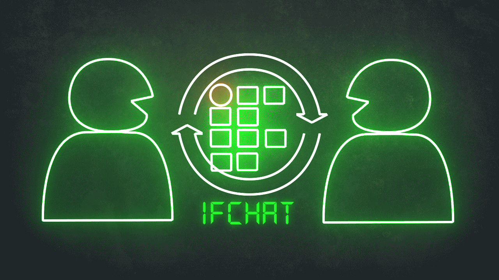

<h1 align="center">
  <strong>IFChat - Application</strong>
</h1>

    
    
    

---

<h2 align="center"><strong>Descrição</strong></h2>

O software IFChat-Application visa inserir um novo meio de comunicação institucional para os alunos do Instituto Federal, a aplicação se encontra em desenvolvimento.
Está-se utilizando da linguagem de programação Java Script ([React Native](https://reactnative.dev/)) e o banco de dados não relacional [Firebase](https://firebase.google.com/?hl=pt-br), para fazer o login do usuário no sistema estamos utilizando da biblioteca [Firebase Authentication](https://firebase.google.com/docs/auth) e, para guardar as informações de mensagens estamos utilizando o [Firebase Realtime Database](https://firebase.google.com/docs/database).

Para o desenvolvimento deste projeto estamos utilizando as bibliotecas a seguir:
- [React Native Router Flux](https://github.com/aksonov/react-native-router-flux)
- [React Native Gesture Handler](https://github.com/software-mansion/react-native-gesture-handler)
- [React Native Gifted Chat](https://github.com/FaridSafi/react-native-gifted-chat)
- [React Native Animatable](https://github.com/oblador/react-native-animatable)
- [Firebase](https://firebase.google.com/?hl=pt-br)

---
<h3><strong>Integrantes do Grupo</strong></h3>
- [Gabriel Bobello](https://github.com/GBobello)

---
<h3><strong>Orientador</strong></h3>
- [Romulo Beninca](https://github.com/rbeninca)
